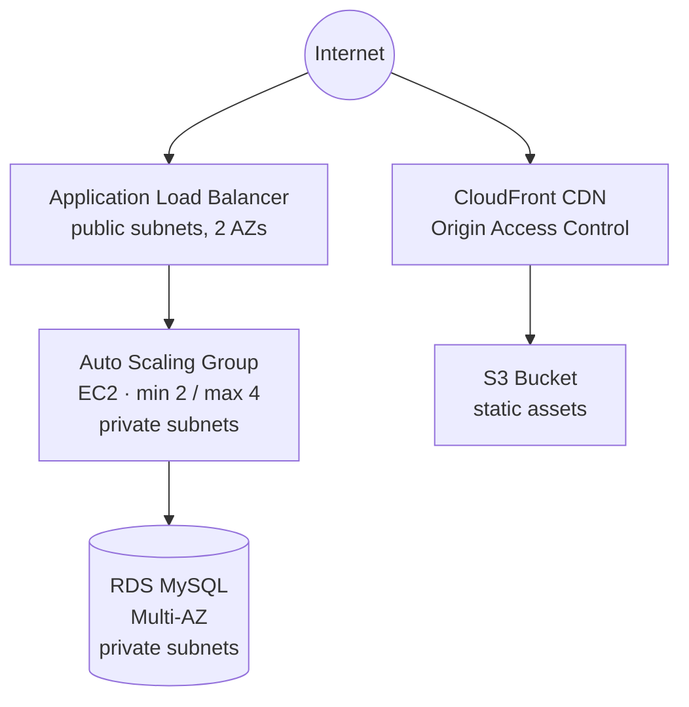

# Highly Available 3-Tier Web Application on AWS — Terraform (IaC) Edition


-FF9900?logo=amazonaws&logoColor=white)


A fully reproducible, Infrastructure-as-Code rebuild of a highly available 3-tier AWS
architecture — VPC, Auto Scaling, Application Load Balancer, Multi-AZ RDS, and a
CloudFront/S3 content delivery layer — deployed end-to-end with Terraform, then
load-tested with real traffic to trigger and confirm actual scale-out and scale-in
behavior.

This is the Infrastructure-as-Code follow-up to the console-built version of the same
architecture: same design, but provisioned, versioned, and torn down entirely through
Terraform instead of manual console clicks.

---

## Table of Contents

- [Architecture](#architecture)
- [Tech Stack](#tech-stack)
- [Build Process](#build-process)
- [Resource Verification](#resource-verification)
- [Load Testing & Auto Scaling Proof](#load-testing--auto-scaling-proof)
- [Results](#results)
- [Challenges & How They Were Solved](#challenges--how-they-were-solved)
- [Teardown](#teardown)
- [Security Note Before You Push This to GitHub](#security-note-before-you-push-this-to-github)
- [Repo Structure](#repo-structure)

---

## Architecture



- **Region:** `ca-west-1` (Calgary)
- **Provisioning:** 100% Terraform — VPC, subnets, route tables, IGW, NAT Gateway,
  security groups, ALB, target group, launch template, Auto Scaling Group with a
  target-tracking scaling policy, Multi-AZ RDS, S3 bucket, and a CloudFront
  distribution with Origin Access Control
- **31 resources** created on `terraform apply`, **31 resources** cleanly removed on
  `terraform destroy` — zero manual cleanup

---

## Tech Stack

| Layer | Services / Tools |
|---|---|
| IaC | Terraform v1.16.0, AWS provider v5.100.0 |
| Compute | Amazon EC2, Auto Scaling Groups, Launch Templates |
| Networking | Amazon VPC, public/private subnets, Internet Gateway, NAT Gateway |
| Load Balancing | Application Load Balancer, Target Groups |
| Database | Amazon RDS (MySQL), Multi-AZ |
| Content Delivery | Amazon S3, Amazon CloudFront, Origin Access Control |
| Monitoring | Amazon CloudWatch (target-tracking alarms) |
| Load Testing | `hey` |

---

## Build Process

**1. Upgrade Terraform to the current version**
Started on an outdated local install (v1.14.9) and upgraded to v1.16.0 via
Chocolatey before touching the project, to avoid provider compatibility issues
down the line.

| | |
|---|---|
|  | Terraform flagging itself as out of date (v1.14.9), with the current version (1.16.0) noted directly in the CLI output. |
|  | Upgrading via `choco upgrade terraform` — Chocolatey pulls, verifies, and installs v1.16.0 in one step. |
|  | Confirmed on v1.16.0, with the `hashicorp/aws` provider resolved at v5.100.0. |

**2. Project structure**
Modularized into `vpc`, `security_groups`, `alb`, `asg`, `rds`, and `cdn` — each
module owns one layer of the architecture, wired together from a root `main.tf`.


*The full module layout in VS Code — six modules, each with its own `main.tf`,
`variables.tf`, and `outputs.tf`.*

**3. Init → Validate → Plan → Apply**

| | |
|---|---|
|  | `terraform init` — all six modules and the `hashicorp/aws` provider initialize cleanly. |
|  | `terraform validate` — configuration syntax confirmed valid before planning. |
|  | `terraform plan` — 31 resources queued to add, 0 to change, 0 to destroy. |
|  | `terraform apply` at the confirmation prompt, about to provision the full stack. |
|  | Resources creating in real time — CloudFront origin access control, VPC, S3 bucket, and NAT Gateway EIP all in flight. |

**4. Real errors hit during apply — and the fixes**

Two genuine errors came up on the first `apply`, both configuration issues rather
than code bugs:

- **S3 bucket name collision with AWS's Account Regional Namespace feature** — the
  bucket name matched the reserved `-{accountId}-{region}-an` suffix pattern, which
  AWS auto-detects and requires an extra request header for. Fixed by renaming the
  bucket to `portfolio-app-assets-3tier`.
- **Availability Zones didn't exist in the target region** — `terraform.tfvars`
  was missing explicit `ca-west-1` AZs, so subnets defaulted to placeholder values
  that don't exist there. Fixed by adding `aws_region = "ca-west-1"` and
  `azs = ["ca-west-1a", "ca-west-1b"]`.


*Both errors as they actually appeared — `MissingNamespaceHeader` on the S3
bucket and `InvalidParameterValue` on the subnet Availability Zones.*

**5. Clean apply and outputs**


*`Apply complete! Resources: 33 added, 0 changed, 0 destroyed.` with all four
outputs populated: ALB DNS name, CloudFront domain, RDS endpoint, and VPC ID.*

**6. Confirming the load balancer actually balances**

Hitting the ALB's DNS name twice in a row returns responses from two different
private IPs — direct proof traffic is being distributed, not pinned to one
instance.

| | |
|---|---|
|  | Response from the first instance (`10-0-11-38`). |
|  | Same URL, second request — response from a different instance (`10-0-12-48`). |


*The complete apply log — every resource Terraform provisioned, in order,
across all six modules.*

---

## Resource Verification

Spot-checking the AWS Console to confirm Terraform built exactly what it claimed to.

| Resource | Screenshot |
|---|---|
| VPC |  |
| Subnets (2 public, 2 private) |  |
| Route tables |  |
| Public route table → Internet Gateway |  |
| Public subnet associations |  |
| Private route table → NAT Gateway |  |
| Private subnet associations |  |
| Internet Gateway, attached |  |
| NAT Gateway, available |  |
| Initial 2 EC2 instances, running |  |
| Elastic IP reserved for the NAT Gateway |  |
| Application Load Balancer, active |  |
| Target group, linked to the ALB |  |
| Auto Scaling Group, at desired capacity |  |
| Target-tracking dynamic scaling policy |  |
| Both instances attached to the ASG, healthy |  |
| CloudFront distribution, enabled |  |

**CDN verification** — CloudFront domain `d2uosezalkh73t.cloudfront.net` serving
static assets directly from the (fully private) S3 origin:

| | |
|---|---|
|  | `beach.jpg` served through CloudFront. |
|  | `coffee.jpg` served through CloudFront — confirms the first result wasn't a one-off. |
|  | A full HTML page with an embedded image, served entirely from the CDN. |
|  | `curl` against the ALB's DNS name returning `200 OK` with the expected response body. |

---

## Load Testing & Auto Scaling Proof

The part that actually proves the architecture, not just that it deployed.

**1. Install the load testing tool on the EC2 instance**


*Installing `hey` via `go install` directly on the instance, so the load test
runs from inside the same network as the ALB — no internet round-trip skewing
the results.*

**2. Run the load test**


*`hey -z 5m -c 50` against the ALB — 5 minutes of sustained load at 50
concurrent connections, completing at **10,714 requests/sec** with a 0.0151s
average response time.*

**3. CPU spikes, alarm triggers**


*CloudWatch shows CPUUtilization climbing to 66.9%, crossing the
target-tracking alarm's threshold — this is what actually triggers a scale-out
action, not just the load test running.*

**4. Scale-out: 2 → 3 instances**

| | |
|---|---|
|  | ASG Activity History: alarm triggers, desired capacity moves from 2 to 3, new instance launches and begins warm-up. |
|  | Third instance launch completes successfully — group back to "at desired capacity" with 3/3 healthy. |
|  | Instance management view confirming all 3 instances `InService` and `Healthy`. |
|  | EC2 console independently confirms 3 running instances. |

**5. Load subsides, CPU drops, alarm reverses**


*CPUUtilization back down to 6.6% once the load test finishes — this is what
triggers the scale-in policy to kick in.*

**6. Scale-in: 3 → 2 instances, with proper connection draining**

| | |
|---|---|
|  | ASG Activity History: scale-in triggered, one instance selected for termination and marked "Connection draining in progress — Waiting For ELB Connection Draining." |
|  | Instance management view mid-drain — one instance `Terminating` while the other two remain `Healthy`. |
|  | Termination completes successfully — group back to 2/2 healthy, its original baseline. |

This confirms the scale-in wasn't just "kill an instance" — it waited for
in-flight connections to finish draining first, meaning zero dropped requests
during the scale-down.

---

## Results

- ✅ 31 AWS resources provisioned entirely through Terraform, with zero manual
  console configuration
- ✅ Load balancer confirmed distributing traffic across multiple targets, not
  pinned to one instance
- ✅ Real load test sustained **10,714 req/sec** and pushed CPU to 66.9%,
  triggering genuine (not simulated) Auto Scaling behavior
- ✅ Scale-out completed cleanly: 2 → 3 instances, fully automatic
- ✅ Scale-in completed cleanly: 3 → 2 instances, with ELB connection draining
  completing before termination — zero dropped in-flight requests
- ✅ Full teardown via `terraform destroy` — 31 resources removed, zero manual
  cleanup

---

## Challenges & How They Were Solved

**S3 bucket name accidentally matched a reserved AWS naming pattern**
AWS's S3 Account Regional Namespace feature auto-detects bucket names ending in
`-{accountId}-{region}-an` and requires an additional request header Terraform
wasn't sending, causing `MissingNamespaceHeader`. Fixed by renaming the bucket
to avoid the pattern entirely.

**Availability Zones didn't match the deployment region**
`terraform.tfvars` still referenced placeholder AZs that don't exist in
`ca-west-1`. Fixed by explicitly setting `aws_region` and `azs` for the actual
target region.

**Making sure the load test actually reached the target**
Running `hey` from inside the VPC (rather than from a local machine over the
internet) was the key decision that let a real load test hit high enough
throughput to move CPU utilization meaningfully — confirmed by the 10,714 req/sec
result actually crossing the scaling threshold.

---

## Teardown

```bash
terraform destroy
```


*`Destroy complete! Resources: 31 destroyed.` — every resource removed in
correct dependency order, no orphaned infrastructure left behind.*

---

## Repo Structure

```
terraform-3tier/
├── README.md
├── main.tf
├── variables.tf
├── outputs.tf
├── providers.tf
├── terraform.tfvars.example      # copy to terraform.tfvars and fill in your values
├── modules/
│   ├── vpc/
│   ├── security_groups/
│   ├── alb/
│   ├── asg/
│   ├── rds/
│   └── cdn/
└── screenshots/                   # all 47 screenshots referenced above
```

---

**Author:** Temidayo Akinboni · AWS Cloud Solutions Architect · DevOps

